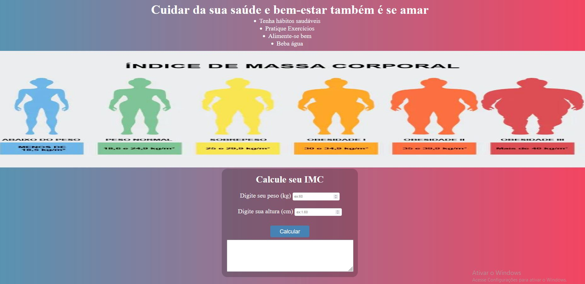

<h1 align="center">
    Calculadora de IMC
</h1>

---

## ✉ Sobre
O projeto **Calculadora de IMC** é um programa criado para calcular o índice de massa corporal de uma 
pessoa com base na sua altura e peso. Criei esse projeto com o intuito de colocar em prática
ainda mais os meus conhecimentos. 

---

## 🚀 Tecnologias utilizadas

O projeto foi desenvolvido utilizando as seguintes tecnologias:

- HTML
- CSS
- JavaScript